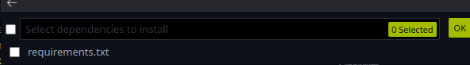
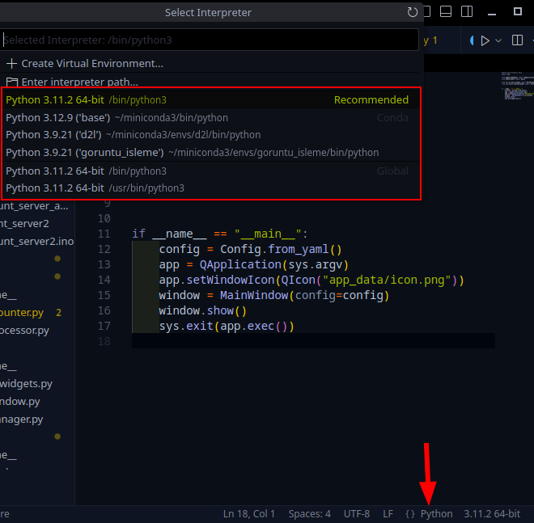

# Deneyap Kart ile Parmakla Led Yakma

## Proje Hakkında

Bu proje, Deneyap Kart kullanarak bir kamera üzerinden algılanan parmak sayısına göre LED'leri yakıp söndürmeyi sağlar. Kullanıcının gösterdiği parmak sayısı kamera tarafından algılanır ve bu sayıya karşılık gelen LED'ler yanar.

## Gereksinimler

- Deneyap Kart
- Bilgisayar kamerası
- LED'ler (projede kullanılan sayıda)
- Jumper kablolar
- Breadboard
- USB güç kaynağı veya taşınabilir bir güç kaynağı

## Kurulum

1. Deneyap Kart'ı bilgisayarınıza bağlayın.
2. USB kamerayı Deneyap Kart'a bağlayın.
3. LED'leri aşağıdaki pin yapılandırmasına göre bağlayın:
(Kullandığınız kart modeline göre pin numaraları değişebilir, lütfen kartınıza uygun pinleri kontrol edin. Kod içiresinde hazır olanları kontrol edebilirsiniz.)
   - LED 1: Pin D9
   - LED 2: Pin D12
   - LED 3: Pin D13
   - LED 4: Pin D14
   - LED 5: Pin D15

## Yazılım Kurulumu

### Deneyap Kart Hazırlık
1. Arduino IDE'yi açın.
2. finger_count_server kodlarından birini seçin
    - **finger_count_server_2**: aynı ağda olmak için ağ ismini ve şifresini girmeniz gerekiyor.
        - `const char* ssid ` `const char* password`
    - **finger_count_server_ap**: bunun için herhangi bir ağ ayarı yapmanıza gerek yoktur. Deneyap Kart kendi ağını oluşturur ve bu ağa bilgisayarınızla bağlanarak parmak sayısını algılayabilirsiniz.
3. Proje dosyasını Arduino IDE'ye yükleyin ve Deneyap Kart'a gönderin.

### Python Kütüphaneleri
1. Bilgisayarınıza Python 3.x (x >= 9) yükleyin.
2. Vs Code ile sanal ortam oluşturun ve aktif edin.
    - Sonrasında **main.py** dosyasını açıp `shift+ctl+p` tuşlarına basıp `env` yazdığınız zaman Python ortamı oluşturun veya Python: create environment basmanız gerekmektedir. Sonarsında sanal ortamı oluşturmanız gerekmektedir. 
    - Oluşturma sırasında size bağımlıkları yüklemenizi isteyen bir seçenek çıkabilir. Seçip otomatik olarak kurulumu yapabilirsiniz

    - eğer otomatik çıkmazsa aşağıdaki kodu uç birime(terminale) yapıştırıp yükleyebilirsiniz.

`pip install -r requirements.txt`

3. Sonrasında **main.py** dosyasını açın ve çalışan bir python ortamı seçin. (Python 3.x)
    - Sağ alt köşede Python ortamını seçebileceğiniz bir alan var. Oradan oluşturduğunuz sanal ortamı seçin.
    - Eğer orada gözükmüyorsa `ctrl+shift+p` tuşlarına basıp `Python: Select Interpreter` yazıp oluşturduğunuz sanal ortamı seçin.

## Kullanım

1. Sistemi çalıştırın ve kameranın önünde elinizi gösterin.
2. Elinizde gösterdiğiniz parmak sayısına göre (1-5 arası) o sayıdaki LED yanacaktır.
3. Örneğin:
   - 1 parmak gösterirseniz: 1 LED yanar
   - 3 parmak gösterirseniz: 3 LED yanar
   - 5 parmak gösterirseniz: 5 LED yanar

## Sorun Giderme

- **Kamera algılamıyor**: Kameranın düzgün bağlandığından ve yeterli ışık olduğundan emin olun.
- **LED'ler yanmıyor**: Bağlantıları kontrol edin ve kod içerisinde pin tanımlamalarının doğru olduğundan emin olun.
- **Parmak sayısı yanlış algılanıyor**: Elinizi kameraya daha yakın tutun ve arka planın düz renkli olmasını sağlayın.

## Kod Açıklaması

Proje kodu temelde şu işlemleri gerçekleştirir:

1. Kameradan görüntü alır
2. MediaPipe kütüphanesi ile el pozisyonunu tespit eder
3. Parmak sayısını algılar
4. Algılanan parmak sayısına göre LED'leri kontrol eder

## İletişim ve Destek

Projeyle ilgili sorularınız veya önerileriniz için github üzerinden issue açabilirsiniz. Ayrıca, projeyi geliştirmek veya katkıda bulunmak isterseniz, pull request gönderebilirsiniz.

## Lisans

Bu proje MIT lisansı altında dağıtılmaktadır. Daha fazla bilgi için LICENSE dosyasına bakın.